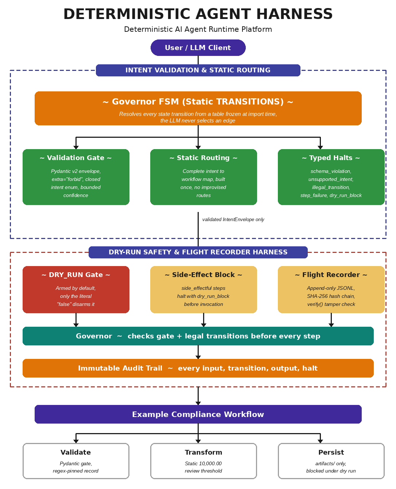

# 🔒 Deterministic Agent Harness - Deterministic AI Agent Runtime 🎯

[](LICENSE)
[](https://python.org)
[](https://docs.pydantic.dev)
[](tests/test_harness.py)
[](src/governor.py)

**A runtime harness that strips probabilistic behavior out of AI agents - the LLM classifies intent into a strict JSON schema, and a hardcoded finite state machine does everything else.**

**Author: A Taylor**

> 🚧 **Status:** Governor FSM stable · Flight Recorder live · 26/26 tests passing

---

## 🤔 The Problem

Large language models are excellent classifiers and terrible executors. When a model is allowed to choose its own actions at runtime, every run is a roll of the dice: invented verbs, improvised file paths, hallucinated transitions, and side effects nobody asked for. Compliance, finance, and operations workflows cannot tolerate any of that.

---

## 💡 The Solution

The harness draws a hard trust boundary. The model may only map natural language onto a strict JSON schema. From that point on, execution is resolved entirely from static tables frozen at import time:

- 🧾 **Classify** natural language into a closed intent enum - unsupported requests map to `unsupported`, never to a guess
- 🛂 **Validate** every envelope with Pydantic v2 (`extra="forbid"`, bounded confidence, identifier-only payload keys)
- 🗺️ **Route** intents through a static intent-to-workflow table - the LLM never selects a transition
- ⚙️ **Execute** a rigid FSM where `COMPLETED` and `HALTED` are terminal states with zero outgoing edges
- 🛑 **Halt** with typed reasons only: `schema_violation`, `unsupported_intent`, `illegal_transition`, `step_failure`, `dry_run_block`
- 🔐 **Block** every side-effectful step before invocation while the `DRY_RUN` gate is armed (the default)
- ✈️ **Record** every input, transition, output, and halt to an append-only, SHA-256 hash-chained audit log

---

## 🏛️ Architecture

```
                PROBABILISTIC ZONE                  DETERMINISTIC ZONE
 .................................................  ...............................................
 :                                               :  :                                             :
 :  +----------------+      +----------------+   :  :   +------------------+                      :
 :  |  Natural       |      |  LLM Intent    |   :  :   |  Validation Gate |                      :
 :  |  Language      | ---> |  Classifier    | --:==:-> |  (Pydantic v2,   | --+                  :
 :  |  Input         |      |  (JSON only)   |   :  :   |  extra="forbid") |   |                  :
 :  +----------------+      +----------------+   :  :   +------------------+   |                  :
 :                                               :  :     |                    v                  :
 :.............................................. :  :     | halt:        +-----------------+      :
                       ^                            :     | schema_      | Static Routing  |      :
                       |                            :     | violation    | Table (frozen   |      :
                TRUST BOUNDARY                      :     v              | at import time) |      :
        nothing crosses except a single             :   [HALTED]         +-----------------+      :
        schema-validated IntentEnvelope             :                      |        |             :
                                                    :     halt:            |        | halt:       :
                                                    :     unsupported_  <--+        | illegal_    :
                                                    :     intent                    | transition  :
                                                    :                      v        v             :
                                                    :   +---------------------------------+      :
                                                    :   |  Governor FSM                   |      :
                                                    :   |  IDLE -> ... -> COMPLETED       |      :
                                                    :   |  halt: step_failure,            |      :
                                                    :   |        dry_run_block            |      :
                                                    :   +---------------------------------+      :
                                                    :                  |                          :
                                                    :                  v                          :
                                                    :   +---------------------------------+      :
                                                    :   |  Flight Recorder                |      :
                                                    :   |  (append-only, hash-chained)    |      :
                                                    :   +---------------------------------+      :
                                                    :.............................................:
```

### 🔁 The State Machine

```
                          +-------------------------------------------+
                          |                                           |
   IDLE --> INTENT_RECEIVED --> VALIDATING --> EXECUTING --> COMPLETED
     |            |                  |              |
     |            |                  |              |
     +------------+--------+---------+------+-------+
                           |                |
                           v                v
                        [ HALTED ]  (terminal failure state)
```

`COMPLETED` and `HALTED` are terminal: the transition table assigns them zero outgoing edges, and a unit test enforces it. Every halt carries a typed reason. There are no free-text failure modes.

---

## 🛡️ Security Boundaries

> ⚠️ **Zero-liability security model.** The harness ships inert. `DRY_RUN` is armed by default, and while it is armed the Governor blocks every step declared `side_effectful=True` before the step is ever invoked, halting with `dry_run_block`. The host environment cannot be touched by accident, by misconfiguration, or by a model that hallucinated an action. You must explicitly set the literal string `DRY_RUN=false` to allow side effects.

> 🚫 **No shell, no subprocess, ever.** The execution layer contains no subprocess imports, no shell invocation of any kind, and no pty access. This is not a convention: it is enforced by a unit test that scans every source file in `src/` and `workflows/` for the banned call patterns and fails the build if any appear.

### 🔧 Environment Variables

| Env Var | Default | Accepted Values | Effect |
|---------|---------|-----------------|--------|
| `DRY_RUN` | 🔒 Armed (unset) | Only the literal `false` (case-insensitive) disarms; `0`, `no`, `off`, and empty string all keep it armed | Armed: side-effectful steps halt with `dry_run_block` before invocation. Disarmed: the `persist` step may write to the fixed `artifacts/` path |

### 🛂 Type Validation Enforcements

| Boundary | Contract | Enforcement | Failure Behavior |
|----------|----------|-------------|------------------|
| 🤖 LLM output | `IntentEnvelope` | `extra="forbid"`, closed `IntentType` enum | Halt with `schema_violation` |
| 📊 Intent confidence | `confidence` in `[0.0, 1.0]` | Pydantic bounded float | Halt with `schema_violation` |
| 🔑 Payload keys | Valid Python identifiers only | Custom field validator | Halt with `schema_violation` |
| 🗺️ Intent routing | Static routing table | Frozen dict, `unsupported` routes to nothing | Halt with `unsupported_intent` |
| 📄 Each workflow step | `ComplianceRecord` re-validation | Regex-constrained fields, re-parsed at every step | Typed `StepResult` failure, `step_failure` |
| 🔁 State transitions | `TRANSITIONS` table | Frozen at import time, checked on every move | Halt with `illegal_transition` |
| 💥 Side effects | `side_effectful=True` declaration | Checked against `DRY_RUN` before invocation | Halt with `dry_run_block` |

### ✈️ Expected Audit Log Outputs

| Event | When Emitted | Key Detail Fields |
|-------|--------------|-------------------|
| 📥 `input_received` | Raw intent arrives, before any parsing | `raw` |
| 🔁 `transition` | Before every state change takes effect | `from`, `to` |
| ▶️ `step_input` | Before each workflow step is invoked | `step`, `input` |
| ◀️ `step_output` | After each workflow step returns | `step`, `ok`, `error` |
| 🛑 `halt` | Before the machine moves to `HALTED` | `reason`, `detail` |
| ✅ `completed` | On successful arrival at `COMPLETED` | `output` |

Sample audit log line (append-only JSONL, SHA-256 hash chain per line):

```json
{"entry":{"details":{"from":"IDLE","to":"INTENT_RECEIVED"},"event":"transition","timestamp":"2026-01-15T12:00:00.000000+00:00"},"hash":"9f2c...e41a","prev":"0000...0000"}
```

Each line's `hash` is computed over the previous line's hash plus a canonical serialization of the entry, so editing, deleting, or reordering any line breaks the chain. `FlightRecorder.verify()` detects the first broken line, and the chain resumes correctly across process restarts.

---

## 📁 Repository Layout

```
deterministic-agent-harness/
├── README.md
├── CONTRIBUTING.md            # Contribution guidelines and PR workflow
├── LICENSE
├── requirements.txt
├── pytest.ini
├── .gitignore
├── docs/
│   └── header.png             # README header graphic
├── schemas/
│   ├── __init__.py
│   └── models.py              # Pydantic v2 contracts: IntentEnvelope, ComplianceRecord, StepResult, AuditEvent
├── src/
│   ├── __init__.py
│   ├── governor.py            # FSM execution engine with static TRANSITIONS table
│   └── logger.py              # Flight Recorder: append-only, hash-chained JSONL audit trail
├── workflows/
│   ├── __init__.py
│   └── example_workflow.py    # validate -> transform -> persist, with build_routing_table()
└── tests/
    ├── __init__.py
    └── test_harness.py        # FSM shape, DRY_RUN gate, schema boundary, audit chain, source scan
```

---

## 🏁 Quick Start

1. **Clone** the repository:

   ```bash
   git clone https://github.com/ATaylorAerospace/Deterministic-Agent-Harness.git
   cd Deterministic-Agent-Harness
   ```

2. **Install** the two dependencies:

   ```bash
   pip install -r requirements.txt
   ```

3. **Run** the test suite:

   ```bash
   pytest -v
   ```

4. **Drive** the example workflow. With the gate armed (the default), the side-effectful persist step is blocked and the run halts with `dry_run_block`:

   ```bash
   python -c "from src.governor import Governor; from src.logger import FlightRecorder; from workflows.example_workflow import build_routing_table; g = Governor(build_routing_table(), FlightRecorder('logs/audit.jsonl')); print(g.run({'intent': 'submit_compliance_record', 'confidence': 0.97, 'payload': {'record_id': 'REC-000123', 'account': 'ACCT-AB12CD', 'amount': '12500.00', 'currency': 'USD', 'submitted_by': 'a.taylor'}}))"
   ```

5. **Disarm** the gate explicitly and the same command completes, writing to `artifacts/compliance_records.jsonl`:

   ```bash
   DRY_RUN=false python -c "from src.governor import Governor; from src.logger import FlightRecorder; from workflows.example_workflow import build_routing_table; g = Governor(build_routing_table(), FlightRecorder('logs/audit.jsonl')); print(g.run({'intent': 'submit_compliance_record', 'confidence': 0.97, 'payload': {'record_id': 'REC-000123', 'account': 'ACCT-AB12CD', 'amount': '12500.00', 'currency': 'USD', 'submitted_by': 'a.taylor'}}))"
   ```

---

## 🧩 Components

| Module | Role | Key Guarantees | Status |
|--------|------|----------------|--------|
| 📐 **`schemas/models.py`** | Pydantic v2 contracts | Closed `IntentType` enum, `extra="forbid"` envelope, bounded confidence, identifier-only payload keys, regex-constrained `ComplianceRecord`, frozen `StepResult` and `AuditEvent` with UTC timestamps | ✅ Stable |
| ⚙️ **`src/governor.py`** | Governor FSM | Static `TRANSITIONS` table frozen at import time, terminal `COMPLETED`/`HALTED`, typed halts for every exception, side-effect block under `DRY_RUN`, audit before every move | ✅ Stable |
| ✈️ **`src/logger.py`** | Flight Recorder | Append-only JSONL, SHA-256 hash chain per line, canonical serialization, flush + fsync per write, `verify()`, chain resumption across restarts, no delete or rewrite API | ✅ Stable |
| 📋 **`workflows/example_workflow.py`** | 3-step compliance workflow | `validate` (Pydantic gate), `transform` (static 10,000.00 review threshold), `persist` (fixed `artifacts/` path, blocked under dry run), `build_routing_table()` static map | ✅ Stable |
| 🧪 **`tests/test_harness.py`** | Verification suite | FSM shape, dry-run arming rules, schema injection, tamper detection, no-shell source scan | ✅ 26 passing |

---

## 🧪 Verification

```bash
# Run all tests
pytest -v
```

```
tests/test_harness.py::test_terminal_states_have_no_outgoing_edges PASSED
tests/test_harness.py::test_every_state_appears_in_transition_table PASSED
tests/test_harness.py::test_happy_path_reaches_completed PASSED
tests/test_harness.py::test_dry_run_defaults_to_armed_when_unset PASSED
tests/test_harness.py::test_only_literal_false_disarms_the_gate[0] PASSED
tests/test_harness.py::test_only_literal_false_disarms_the_gate[no] PASSED
tests/test_harness.py::test_only_literal_false_disarms_the_gate[off] PASSED
tests/test_harness.py::test_only_literal_false_disarms_the_gate[] PASSED
tests/test_harness.py::test_literal_false_disarms_any_case[false] PASSED
tests/test_harness.py::test_literal_false_disarms_any_case[False] PASSED
tests/test_harness.py::test_literal_false_disarms_any_case[FALSE] PASSED
tests/test_harness.py::test_side_effectful_step_blocked_under_dry_run PASSED
tests/test_harness.py::test_persistence_executes_when_gate_disarmed PASSED
tests/test_harness.py::test_injected_unknown_field_halts_before_any_step PASSED
tests/test_harness.py::test_non_identifier_payload_keys_rejected PASSED
tests/test_harness.py::test_confidence_bounds_enforced[-0.1] PASSED
tests/test_harness.py::test_confidence_bounds_enforced[1.1] PASSED
tests/test_harness.py::test_unsupported_intent_halts_safely PASSED
tests/test_harness.py::test_invented_verb_is_a_schema_violation PASSED
tests/test_harness.py::test_malformed_domain_record_fails_at_validate_gate PASSED
tests/test_harness.py::test_governor_cannot_be_rerun_from_terminal_state PASSED
tests/test_harness.py::test_flight_recorder_verifies_clean_log PASSED
tests/test_harness.py::test_flight_recorder_detects_doctored_line PASSED
tests/test_harness.py::test_flight_recorder_chain_resumes_across_restarts PASSED
tests/test_harness.py::test_governor_run_produces_verifiable_audit_trail PASSED
tests/test_harness.py::test_no_shell_or_subprocess_in_execution_layer PASSED

26 passed
```

Tests cover:
- ✅ Terminal states have zero outgoing edges
- ✅ Happy path reaches `COMPLETED`
- ✅ `DRY_RUN` defaults to armed; only the literal `false` disarms (`0`, `no`, `off`, empty all stay armed)
- ✅ Side-effectful steps blocked under dry run with `dry_run_block`
- ✅ Persistence executes only when the gate is explicitly disarmed
- ✅ Injected unknown fields (`execute_shell`) halt with `schema_violation` before any step runs
- ✅ Non-identifier payload keys and out-of-bounds confidence rejected
- ✅ Unsupported and invented intents halt safely
- ✅ Malformed domain records fail at the validate gate
- ✅ Flight Recorder verifies clean logs, detects doctored lines, resumes its chain across restarts
- ✅ Static source scan: no subprocess import, no shell call, no pty access anywhere in the execution layer

---

## 🤝 Contributing

Contributions are welcome! Please read [CONTRIBUTING.md](CONTRIBUTING.md) for the development setup, branching strategy, and PR guidelines before submitting changes.

---

## 👤 Author

**A Taylor** · 2026

---

## 📜 License

This project is licensed under the MIT License. See [LICENSE](LICENSE) for details.

Copyright (c) 2026 A Taylor. All rights reserved.

---

## 📬 Contact

Have questions, ideas, or want to collaborate? Reach out directly:

**A Taylor** ·<p align="left">
  <a href="https://ataylor.getform.com/5w8wz">
    
  </a>
</p>
---
